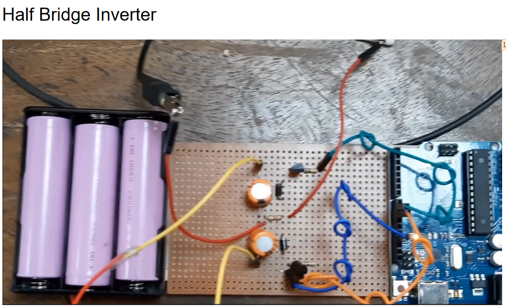

# Half bridge inverter

## An arduino project
This project, undertaken by a team of three members, involved developing a basic half-bridge inverter using Arduino technology.[(Details in Github)](https://github.com/mahbuba26/Half-bridge-inverter)

The system utilized a 12V input, with the output analyzed and measured using an oscilloscope.We observed an output of approximately 5 volts.

The output of the program is:

 
